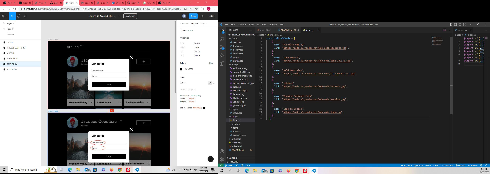

# Around The U.S.

**Project name**

"Around The U.S" (se_project_aroundtheus)

**Recent updates**

- Edit modal, Add modal, and Like-Button functionality
- Delete button active
- Open picture with smooth transition on modals designed
- Complete user interactivity
- Live Validation
- Destructured syntax
- Advanced OOP

**Description**

Around the U.S landing page with responsive layouts for mobile (320px) and desktop (1280px) views. Intervals between 320px-768px and 768px-1280px.
Responsive, user-interactive button, form and picture features.

**Technologies used**

- edit, add, like-button, delete-button and picture modal interactivity assigned.
- adding new card assigning title and url connects user to page.
- card array declared through javascript.
- smooth transition on all modals opening and closing using transition: visibility and opacity.
- grid-template-areas command applied to profile and card blocks.

**Pictures**

**Links**

- [Link to Github](https://github.com/DominickDJ/se_project_aroundtheus.git)

- [View finished Project](https://dominickdj.github.io/se_project_aroundtheus/)

- [Link to the project design on Figma](https://www.figma.com/file/m79HxYeZpOXRw0Tz2eZGOV/Sprint-5%3A-Around-The-U.S.-%7C-desktop-%2B-mobile?node-id=0-1&t=MVefN4hChhv40Gc3-0)

**Deployment**

For best results, view in Chrome or Firefox.
